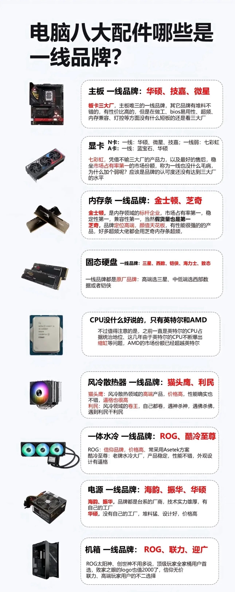

<h1 align='center'><span style="color: orange">装机配置 </span></h1>

| 硬&nbsp;&nbsp;件 |            型号            |   品牌   |   价格    |
| :--------------: | :------------------------: | :------: | :-------: |
|       显卡       |    RTX 5080 Ultra W OC     |  七彩虹  |   9289    |
|       CPU        |       Ryzen 7 9700X        |   AMD    |   1579    |
|       电源       | LEADEX VIII 1000W 白金全模 |   振华   |    949    |
|       内存       |   DDR5 6000MHz 16GB C36    |  海盗船  |    950    |
|       固态       |       TiPlus7100 2TB       |   致钛   |   1799    |
|       主板       |   B850M GAMING PLUS WIFI   |   微星   |   1099    |
|       机箱       |    包豪斯 O11D Mini V2     |   联力   |    558    |
|       散热       |      大霜塔棱镜 白色       | 九州风神 |    187    |
|       外显       |          P275MV-A          | 泰坦军团 |   1060    |
|       风扇       |  棱镜 4Pro 白镜 ARGB(×9)   |  玄冰风  |    120    |
|       音箱       |   M30SW 2.1音箱（润白）    |  漫步者  |    339    |
|    **Total**     |                            |          | **17929** |

---




<h1 align='center'>伊丽莎白</h1>

[Steam](https://store.steampowered.com/about/)             -`wallpaper`, `losslessScaling`

[ReinaManager](https://github.com/huoshen80/ReinaManager)

[HIKARI FIELD STORE](https://store.hikarifield.co.jp/client)

[QQ](https://im.qq.com/index/#/)

[微信](https://weixin.qq.com/)

[Visual Studio Code](https://code.visualstudio.com/)

[Typora](https://typoraio.cn/)

[百度网盘](https://pan.baidu.com/disk/base/semdownload?utm_source=bingsem1&utm_medium=cpc&utm_account=SS-bingtg102&msclkid=a7805363ebb51c3b1c583ab1e40ab522)

[QQ音乐](https://y.qq.com/download/index.html)

[Dark Reader](https://microsoftedge.microsoft.com/addons/detail/dark-reader/ifoakfbpdcdoeenechcleahebpibofpc?hl=zh-CN)

[有道灵动翻译](https://microsoftedge.microsoft.com/addons/detail/有道灵动翻译/memhacajcfhmibggbgilihlmiiddeggo?hl=zh-CN)

[青柠起始页](https://microsoftedge.microsoft.com/addons/detail/青柠起始页/pcpnigdkpcgemocnjhebmajldpjlbeom?hl=zh-CN)

[Git](https://git-scm.com/install/windows)

[clash](https://arerj.lanzoup.com/iRzAM2arb14b)

[火绒安全](https://www.huorong.cn/person)

[Sumatra PDF](https://www.sumatrapdfreader.org/download-free-pdf-viewer)

[WinRAR - 压缩软件](https://www.winrar.com.cn/download.htm)

[LocalSend](https://localsend.org/zh-CN/download)

[Dism++](https://github.com/Chuyu-Team/Dism-Multi-language)

[LunaTranslator](https://docs.lunatranslator.org/zh/README.html)

[科利特尔软件网](https://software.colithel.com/)

[Everything](https://www.voidtools.com/zh-cn/support/everything/installing_everything/)

[animeko](https://github.com/open-ani/animeko/releases/tag/v5.3.2)

[Crystal Disk Info](https://crystalmark.info/en/download/#CrystalDiskInfo)

[7-Zip](https://sparanoid.com/lab/7z/download.html)

[ScreenToGif](https://www.screentogif.com/)

[pdfbinder](https://code.google.com/archive/p/pdfbinder/downloads)

[Locale-Emulator](https://github.com/xupefei/Locale-Emulator/releases/tag/v2.5.0.1)

```c
// Baidu
驱动人生
uninstall
autohideDesktopIcons
musicTag
ce
scripts: theme, winupdate, hover

// Tree of disk
.
├── C
│   ├── Apps
│   ├── Dev
│   ├── Files
│   │   ├── Baidu
│   │   ├── QQ
│   │   ├── WeChat
│   │   ├── book
│   │   └── material
│   ├── Scripts
│   └── Tools
└── D
    └── Steam
```

