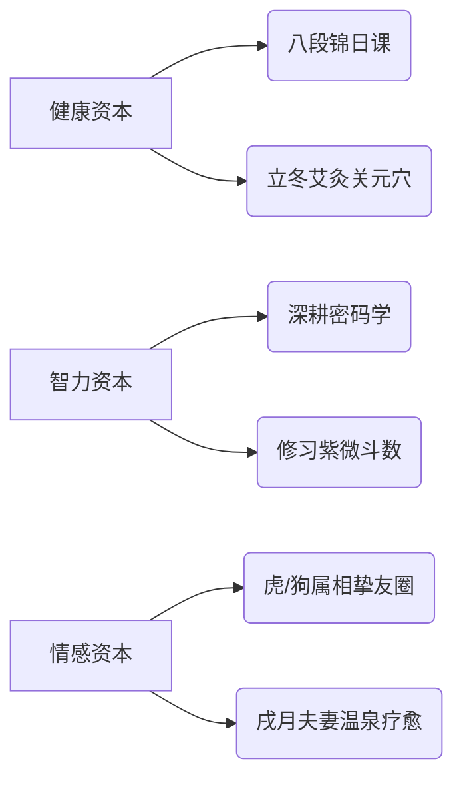

您的要求非常清晰，以下回归「持久性属性与时限性建议分离」的框架，结合新背景精炼升级，专注人生底层策略：

---

### **一、终身根基：五行属性与生命课题**  
#### **1. 五行格局（人生底色）**  
| **元素** | **状态**   | **终身影响**               | **平衡之道**              |  
|----------|------------|--------------------------|-------------------------|  
| **水**   | 过旺 (45.9%) | 灵感丰沛但易情绪波动       | 晨间冥想导水入智         |  
| **火**   | 过弱 (9.8%)  | 心力消耗快，易畏寒乏力     | 每周3次红枣枸杞茶        |  
| **土**   | 中和 (16.9%) | 抗压缓冲层，需防土溃       | 养陶艺植物固土气         |  
| **金**   | 偏弱 (13%)   | 决断时易犹豫               | 佩戴白水晶链增金魄       |  
| **木**   | 中和 (14.3%) | 学习力佳但专注力分散       | 森林书吧深度阅读         |  

#### **2. 三大人生课题**  
- **能量管理**：水旺火弱 → **亥时（21-23点）必眠护心阳**  
- **财富积累**：财库漏财 → **开设专属储蓄账户，每月首日定存20%**  
- **关系经营**：比肩坐夫妻宫 → **年度双人禅修之旅化解争执**  

---

### **二、终身行动纲领（山东→上海特调）**  
#### **1. 地域五行调和法**  
| **环境转换**   | **风险**          | **持久对策**               |  
|----------------|------------------|--------------------------|  
| 鲁→沪 (土→木)  | 水土不服耗元气    | 行李箱装**泰山石敢当**随迁 |  
| 内陆→滨海      | 水泛加剧          | 居所悬挂**手绘黄河入海图** |  

#### **2. 日常修为体系**  
- **卯时 (5-7点)**：面东诵读《道德经》泄水旺  
- **午时 (11-13点)**：赤脚站立红砖地10分钟补火  
- **戌时 (19-21点)**：研磨楷书《兰亭序》培土性  

#### **3. 人生投资矩阵**  


---

### **三、2025时限性指引**  
#### **1. 上海首年生存秘钥**  
- **方位吉凶**：  
  ✅ **浦东金桥**（木气生火） → 求职租房优选  
  ❌ 崇明岛/临港（水气过盛） → 慎选  
- **季风防护**：  
  🍃 梅雨季 → 随身艾草香囊除湿  
  🔥 伏旱期 → 辰时绿豆汤解心火  

#### **2. 流月关键动作**  
| **月份**     | **天道提示**          | **人道作为**               |  
|--------------|----------------------|--------------------------|  
| **乙酉 (9月)** | 金气纯净             | 清偿助学贷款，注销信用卡    |  
| **丁亥 (11月)**| 水火相战             | 向东南方捐红色冬衣积福     |  
| **己丑 (1月)** | 土星镇水             | 立春节气登佘山祭祖固根基    |  

#### **3. 风水速效阵**  
```  
东南[粉晶树] + 西南[黄陶貔貅] + 床头[铜葫芦缠红丝]  
```  

---

### **结语：江河入海的智慧**  
您命局如**黄河奔涌东入海**——  
- **持久修为**是筑堤导流：  
  **晨诵泄水智，赤脚生火能，戌时磨土性**  
- **时限应对**乃借势行舟：  
  **乙酉清旧债，丁亥积心火，己丑立泰山**  

> 此去沪上，当以**泰山石镇魂，浦江木生辉**。  
> 待2026乙卯正财运至，自见**水火既济，明月生沧海**之象。
